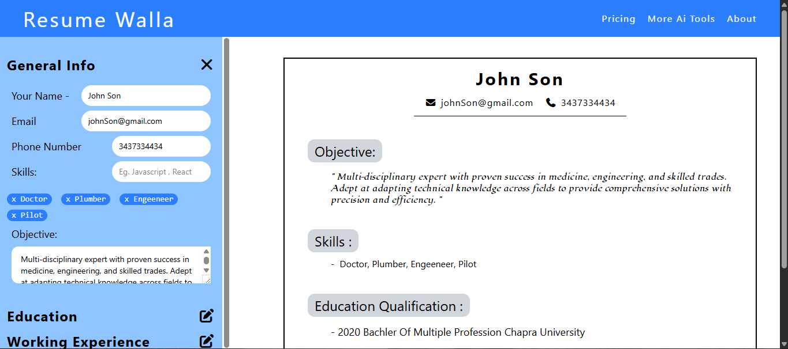

# 📄 Resume Builder - Modern CV Creator  

  
*Clean, professional interface with real-time preview*

## 🌟 Live Demo  
Experience it yourself: [https://cv-application-lokendra.vercel.app](https://cv-application-lokendra.vercel.app)  

## ✨ Overview  
A sleek, interactive resume builder that transforms your professional details into a polished CV instantly. Designed with job seekers in mind, this tool combines React's dynamic capabilities with Tailwind CSS's responsive design to deliver a seamless resume creation experience.

## 🔥 Key Features  

| Feature | Description |  
|---------|-------------|  
| **Real-time Editing** | Instant preview as you type with React state management |  
| **Multi-section CV** | Manage education, work experience, and skills sections |  
| **CRUD Operations** | Add, edit, or remove any section with intuitive controls |  
| **Mobile-friendly** | Fully responsive design works on all devices |  
| **ATS Optimized** | Clean templates that pass applicant tracking systems |  

## 🛠️ Tech Stack  

### Frontend
- **Framework**: React 18  
- **Styling**: Tailwind CSS  
- **Icons**: Font Awesome  
- **State Management**: React Hooks  

### Deployment
- **Hosting**: Vercel  
- **CI/CD**: GitHub Actions  

## 🚀 Getting Started  

1. **Access the App**:  
   Visit [live demo](https://cv-application-lokendra.vercel.app)  

2. **Build Your Resume**:  
   - Fill in personal details  
   - Add education/work history  
   - Manage skills section  

3. **Customize**:  
   - Edit/delete entries anytime  
   - See changes instantly   
